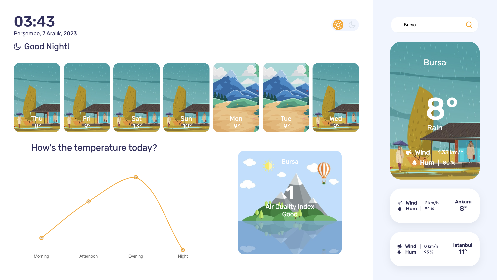
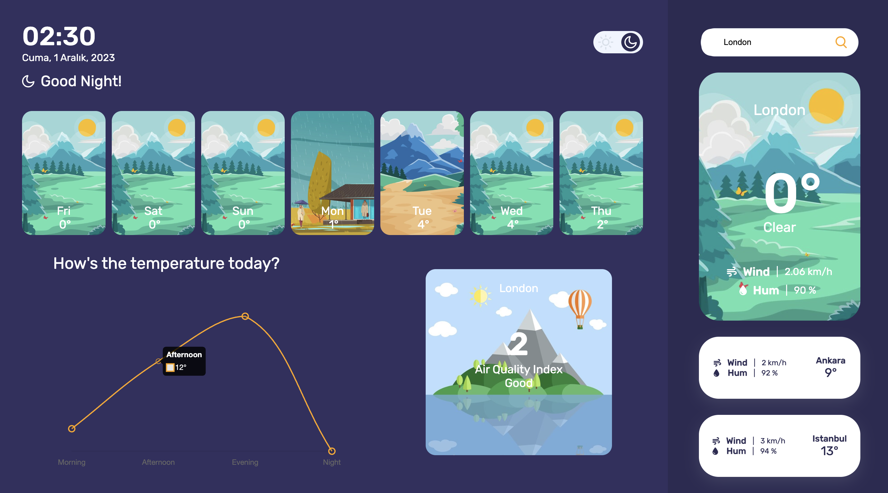

# weather-dashboard
 This project is a weather dashboard developed using HTML, CSS, JavaScript, and the OpenWeather API. It provides users with real-time weather information and allows them to view daily and weekly forecasts based on their location.

